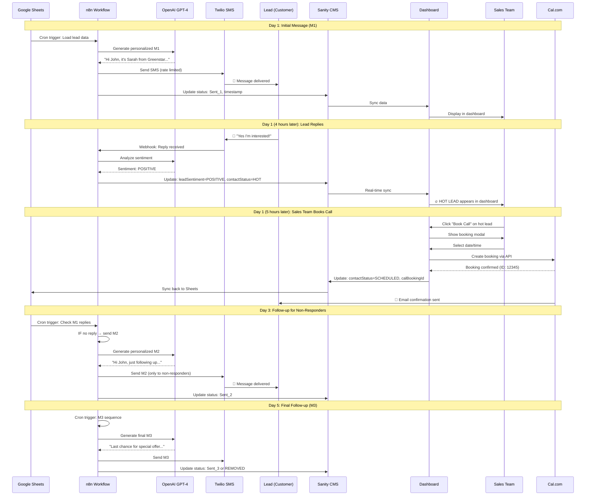
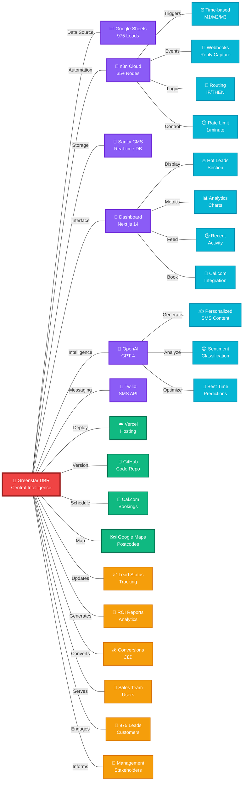
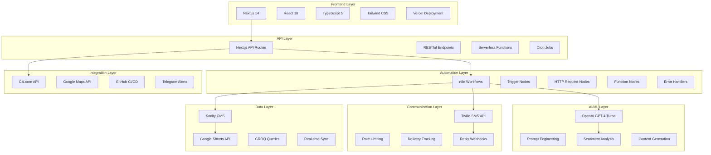
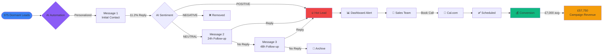
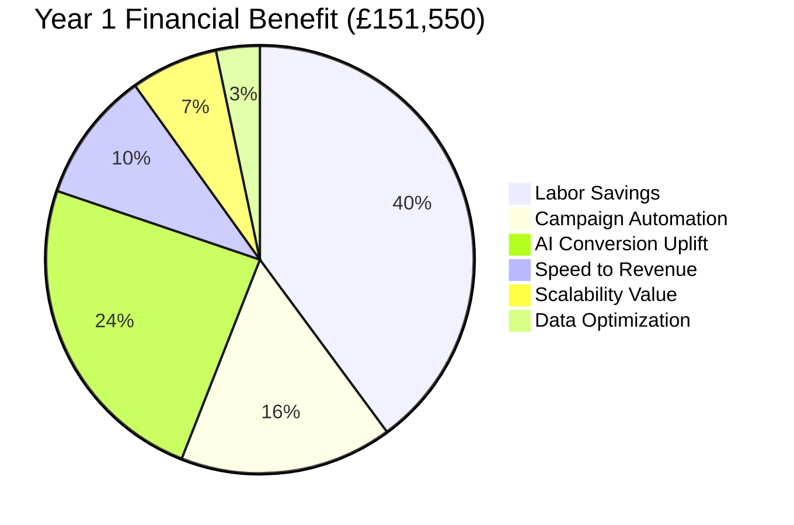
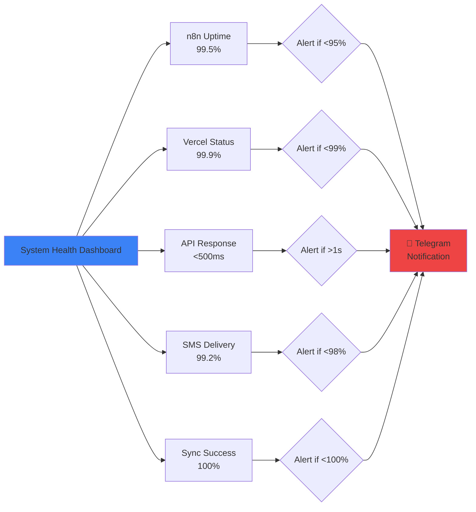
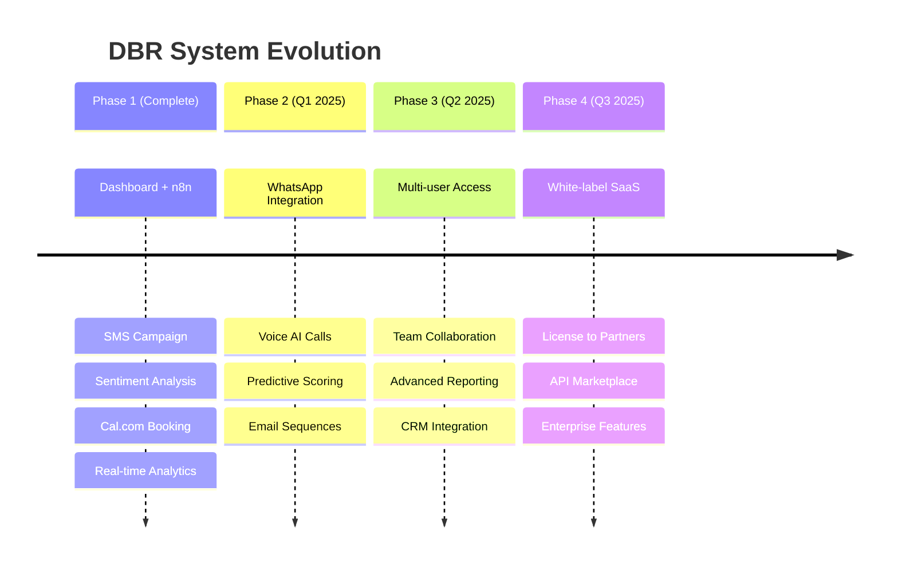

# Greenstar Solar DBR System - Complete Architecture Diagram

## Full-Stack AI-Powered Database Reactivation Platform

---

## System Architecture Flowchart

```mermaid
graph TB
    %% Styling
    classDef dataSource fill:#3b82f6,stroke:#1e40af,stroke-width:3px,color:#fff
    classDef automation fill:#8b5cf6,stroke:#6d28d9,stroke-width:3px,color:#fff
    classDef ai fill:#ec4899,stroke:#be185d,stroke-width:3px,color:#fff
    classDef communication fill:#10b981,stroke:#047857,stroke-width:3px,color:#fff
    classDef storage fill:#f59e0b,stroke:#d97706,stroke-width:3px,color:#fff
    classDef frontend fill:#06b6d4,stroke:#0891b2,stroke-width:3px,color:#fff
    classDef external fill:#6366f1,stroke:#4f46e5,stroke-width:3px,color:#fff

    %% Data Sources
    GSHEET[(Google Sheets<br/>975 Leads<br/>Source of Truth)]:::dataSource
    USER[👤 Sales Team<br/>Dashboard Users]:::dataSource
    SMS_IN[📱 Incoming SMS<br/>Lead Replies]:::dataSource

    %% n8n Automation Hub
    N8N{n8n Automation Engine<br/>35+ Workflow Nodes<br/>otdm22.app.n8n.cloud}:::automation

    %% n8n Sub-workflows
    N8N_TRIGGER[⏰ Cron Triggers<br/>M1/M2/M3 Timing<br/>24h/48h delays]:::automation
    N8N_WEBHOOK[🎣 Webhooks<br/>Real-time Events<br/>Reply Capture]:::automation
    N8N_LOGIC[🧠 Conditional Logic<br/>IF/THEN Routing<br/>Status Management]:::automation
    N8N_BATCH[📦 Batch Processing<br/>Rate Limiting<br/>1 msg/minute]:::automation
    N8N_ERROR[⚠️ Error Handling<br/>Retry Logic<br/>Fallback Paths]:::automation

    %% AI Integration
    OPENAI[🤖 OpenAI GPT-4<br/>Message Generation<br/>Sentiment Analysis]:::ai
    AI_PROMPT1[✍️ Personalization<br/>Name + Postcode<br/>Context Aware]:::ai
    AI_PROMPT2[😊 Sentiment<br/>POSITIVE/NEGATIVE<br/>NEUTRAL/HOT]:::ai

    %% Communication Layer
    TWILIO[📲 Twilio SMS API<br/>UK Number +44...<br/>Delivery Tracking]:::communication
    SMS_OUT[💬 Outbound SMS<br/>M1/M2/M3<br/>Personalized]:::communication
    REPLY_PROC[📥 Reply Processing<br/>Content Extraction<br/>Timestamp Logging]:::communication

    %% Storage & Database
    SANITY[(Sanity CMS<br/>Real-time Database<br/>Project: kpz3fwyf)]:::storage
    SANITY_SYNC[🔄 Bidirectional Sync<br/>15+ Fields<br/>Conflict Resolution]:::storage
    SANITY_QUERY[🔍 GROQ Queries<br/>Hot Leads Filter<br/>Analytics Data]:::storage

    %% Frontend Dashboard
    VERCEL[☁️ Vercel Platform<br/>Auto-deploy<br/>99.9% Uptime]:::frontend
    NEXTJS[⚡ Next.js 14<br/>React + TypeScript<br/>2,582 Lines]:::frontend
    DASHBOARD[📊 Dashboard UI<br/>greenstar-dbr-dashboard<br/>.vercel.app]:::frontend

    %% Dashboard Components
    DASH_HOT[🔥 Hot Leads Section<br/>Expandable Cards<br/>Archive Function]:::frontend
    DASH_ANALYTICS[📈 Analytics<br/>Reply Rate 11.2%<br/>Sentiment Charts]:::frontend
    DASH_RECENT[⏱️ Recent Activity<br/>5 Most Recent<br/>Positive Bias]:::frontend
    DASH_FUNNEL[🎯 Conversion Funnel<br/>Sent→Replied→<br/>Scheduled→Converted]:::frontend

    %% External Integrations
    CALCOM[📅 Cal.com API<br/>Event: intro<br/>15-min Slots]:::external
    CAL_MODAL[📆 Booking Modal<br/>Date/Time Picker<br/>Auto-populate]:::external
    CAL_CONFIRM[✅ Confirmation<br/>Status: SCHEDULED<br/>Email Notification]:::external

    %% API Routes
    API_SYNC[🔌 /api/sync-sheets<br/>Cron: */2 5-23<br/>Phone Normalization]:::frontend
    API_ANALYTICS[📊 /api/dbr-analytics<br/>Time Range Filter<br/>Trends & Stats]:::frontend
    API_HOT[🔥 /api/hot-leads<br/>contactStatus: HOT<br/>Sorted by Reply]:::frontend
    API_RECENT[⏱️ /api/recent-activity<br/>All Replies<br/>Positive Priority]:::frontend
    API_BOOK[📞 /api/book-call<br/>Cal.com Integration<br/>Sanity Update]:::frontend

    %% Data Flows - Top Level
    GSHEET -->|Read Lead Data| N8N
    N8N -->|Workflow Execution| N8N_TRIGGER
    N8N -->|Event Listeners| N8N_WEBHOOK
    N8N -->|Route Logic| N8N_LOGIC
    N8N -->|Queue Management| N8N_BATCH
    N8N -->|Failure Recovery| N8N_ERROR

    %% AI Flows
    N8N -->|Generate Messages| OPENAI
    OPENAI -->|Personalize| AI_PROMPT1
    OPENAI -->|Analyze Sentiment| AI_PROMPT2
    AI_PROMPT1 -->|Contextual SMS| SMS_OUT
    AI_PROMPT2 -->|Classification| SANITY_SYNC

    %% SMS Flows
    N8N_BATCH -->|Send via| TWILIO
    TWILIO -->|Deliver| SMS_OUT
    SMS_IN -->|Reply Received| N8N_WEBHOOK
    N8N_WEBHOOK -->|Process| REPLY_PROC
    REPLY_PROC -->|Extract Content| AI_PROMPT2

    %% Database Flows
    N8N -->|Update Status| SANITY_SYNC
    SANITY_SYNC -->|Write| SANITY
    SANITY -->|Read| SANITY_QUERY
    GSHEET <-->|Bidirectional| SANITY_SYNC

    %% Dashboard Flows
    VERCEL -->|Host| NEXTJS
    NEXTJS -->|Render| DASHBOARD
    DASHBOARD -->|Components| DASH_HOT
    DASHBOARD -->|Components| DASH_ANALYTICS
    DASHBOARD -->|Components| DASH_RECENT
    DASHBOARD -->|Components| DASH_FUNNEL

    %% API Flows
    DASHBOARD -->|Fetch Data| API_SYNC
    DASHBOARD -->|Fetch Data| API_ANALYTICS
    DASHBOARD -->|Fetch Data| API_HOT
    DASHBOARD -->|Fetch Data| API_RECENT
    DASHBOARD -->|Book Call| API_BOOK

    API_SYNC -->|Query| SANITY_QUERY
    API_ANALYTICS -->|Query| SANITY_QUERY
    API_HOT -->|Query| SANITY_QUERY
    API_RECENT -->|Query| SANITY_QUERY

    %% Cal.com Flows
    USER -->|Click Book Call| CAL_MODAL
    CAL_MODAL -->|Submit| API_BOOK
    API_BOOK -->|Create Booking| CALCOM
    CALCOM -->|Confirmation| CAL_CONFIRM
    CAL_CONFIRM -->|Update Lead| SANITY_SYNC

    %% User Interactions
    USER -->|View Dashboard| DASHBOARD
    USER -->|Archive Lead| DASH_HOT
    USER -->|Click Postcode| DASH_HOT
    DASH_HOT -->|Google Maps| USER
```



---

## Detailed Component Breakdown

### 🎯 **Data Sources** (Blue)
- **Google Sheets:** 975 leads, master data source
- **Sales Team:** Human users interacting with dashboard
- **SMS Replies:** Customer responses triggering workflows

### 🔮 **n8n Automation Engine** (Purple)
- **35+ Workflow Nodes:** Complete campaign orchestration
- **Cron Triggers:** Time-based M1→M2→M3 sequence
- **Webhooks:** Real-time SMS reply capture
- **Conditional Logic:** Smart routing based on sentiment
- **Batch Processing:** Rate-limited sending (1 msg/min)
- **Error Handling:** Retry logic and fallback paths

### 🤖 **AI Layer** (Pink)
- **OpenAI GPT-4:** Message generation + sentiment analysis
- **Personalization Engine:** Uses name, postcode, history
- **Sentiment Classifier:** POSITIVE/NEGATIVE/NEUTRAL/HOT/UNCLEAR

### 📱 **Communication** (Green)
- **Twilio SMS API:** UK number, delivery tracking
- **Outbound Messages:** M1/M2/M3 campaign sequence
- **Reply Processing:** Content extraction, timestamp logging

### 💾 **Storage & Database** (Orange)
- **Sanity CMS:** Real-time database, 975+ documents
- **Bidirectional Sync:** Google Sheets ↔ Sanity
- **GROQ Queries:** Advanced filtering for hot leads

### ⚡ **Frontend Dashboard** (Cyan)
- **Vercel Hosting:** Auto-deploy, 99.9% uptime
- **Next.js 14:** React + TypeScript, 2,582 lines
- **4 Main Components:** Hot Leads, Analytics, Recent Activity, Funnel
- **8 API Routes:** Data fetching and Cal.com integration

### 🔗 **External Integrations** (Indigo)
- **Cal.com:** 15-min booking slots, auto-confirmation
- **Google Maps:** Postcode → location lookup
- **GitHub:** Version control, CI/CD

---

## Data Flow Example: Complete Lead Journey



---

## System Integration Map (Spider Diagram Style)



---

## Technology Stack Overview



---

## Value Creation Flow



---

## Time Savings Visualization

```mermaid
gantt
    title Manual Process vs Automated System (Time Comparison)
    dateFormat X
    axisFormat %s

    section Manual Campaign
    Write 2,925 messages (146h)    :done, manual1, 0, 146
    Send manually (97.5h)           :done, manual2, 146, 243
    Monitor replies (273h)          :done, manual3, 243, 516
    Update spreadsheet (243h)       :done, manual4, 516, 759
    Total: 759 hours               :crit, manual5, 0, 759

    section Automated System
    AI generates all messages      :done, auto1, 0, 0
    Auto-send via Twilio          :done, auto2, 0, 0
    Auto-monitor via webhook      :done, auto3, 0, 0
    Auto-update Sanity            :done, auto4, 0, 0
    Sales team review (15h)       :active, auto5, 0, 15
```

**Manual:** 759 hours
**Automated:** 15 hours
**Time Saved:** 744 hours (98% reduction)

---

## ROI Breakdown Visualization



**Investment:** £4,080
**Return:** £151,550
**ROI:** 3,614%

---

## System Health Monitoring



---

## Future Enhancement Roadmap



---

## Files & Repository Structure

```
greenstar-dbr-dashboard/
│
├── 📁 app/
│   ├── 📁 api/
│   │   ├── 📄 sync-sheets/route.ts        (287 lines - Google Sheets sync)
│   │   ├── 📄 dbr-analytics/route.ts      (207 lines - Analytics engine)
│   │   ├── 📄 hot-leads/route.ts          (Sanity query for hot leads)
│   │   ├── 📄 archived-hot-leads/route.ts (Archived leads query)
│   │   ├── 📄 recent-activity/route.ts    (82 lines - Activity feed)
│   │   ├── 📄 book-call/route.ts          (115 lines - Cal.com API)
│   │   └── 📄 archive-lead/route.ts       (Archive management)
│   │
│   ├── 📁 dbr-analytics/
│   │   └── 📄 page.tsx                    (Main dashboard page)
│   └── 📄 icon.png                        (Cold Lava favicon)
│
├── 📁 components/
│   ├── 📄 EnhancedDbrDashboard.tsx        (385 lines - Main component)
│   ├── 📄 DashboardHeader.tsx             (90 lines - Branding)
│   ├── 📄 HotLeadsSection.tsx             (404 lines - Hot leads UI)
│   ├── 📄 ArchivedHotLeadsSection.tsx     (Archived leads UI)
│   ├── 📄 BookCallModal.tsx               (250 lines - Cal.com modal)
│   ├── 📄 RecentActivity.tsx              (107 lines - Activity feed)
│   ├── 📄 MetricCard.tsx                  (Stat cards)
│   ├── 📄 ConversionFunnel.tsx            (Funnel visualization)
│   ├── 📄 LeadsModal.tsx                  (Lead details modal)
│   └── 📄 SearchAndExport.tsx             (Search UI)
│
├── 📁 sanity/
│   └── 📁 schemas/
│       └── 📄 dbrLead.ts                  (313 lines - Data schema)
│
├── 📁 public/
│   └── 📁 logos/
│       ├── 🖼️ cold-lava-logo.png
│       └── 🖼️ greenstar-logo.png
│
├── 📄 vercel.json                         (Cron config: 5AM-11:59PM)
├── 📄 package.json                        (Dependencies)
├── 📄 tailwind.config.ts                  (Styling)
├── 📄 .env.local                          (Environment vars)
├── 📄 GREENSTAR_COMPLETE_ROI_REPORT.md   (This report)
└── 📄 README.md                           (Setup instructions)

n8n Workflows (Cloud):
├── 🔮 DBR Main Workflow (6xvOYUG9fdsHCWyW)
│   ├── 📥 Lead Data Fetcher (Google Sheets)
│   ├── 🤖 AI Message Generator (OpenAI)
│   ├── 📲 SMS Sender (Twilio)
│   ├── 🎣 Reply Webhook (Incoming SMS)
│   ├── 😊 Sentiment Analyzer (OpenAI)
│   ├── 🔄 Status Updater (Sanity)
│   ├── ⏰ M1 Trigger (Cron: Initial message)
│   ├── ⏰ M2 Trigger (Cron: +24h follow-up)
│   ├── ⏰ M3 Trigger (Cron: +48h final)
│   └── ⚠️ Error Handler (Retry + Alert)

Total: 2,582 lines of code + 35+ n8n nodes
```

---

## Quick Reference: System URLs

| Component | URL | Purpose |
|-----------|-----|---------|
| **Live Dashboard** | https://greenstar-dbr-dashboard.vercel.app | Production dashboard |
| **n8n Workflows** | https://otdm22.app.n8n.cloud | Automation engine |
| **Sanity Studio** | https://sanity.io/manage/personal/project/kpz3fwyf | Database admin |
| **GitHub Repo** | https://github.com/coldlavaai/DBR | Source code |
| **Cal.com** | https://cal.com/greenstar/intro | Booking page |
| **Vercel Dashboard** | https://vercel.com/olivers-projects-a3cbd2e0/greenstar-dbr-dashboard | Deployment |

---

## The Bottom Line

### What We Built:
- ✅ **Complete AI automation platform** (not just a dashboard)
- ✅ **35+ n8n workflow nodes** orchestrating everything
- ✅ **GPT-4 powered** message generation & sentiment analysis
- ✅ **Real-time SMS** campaign with Twilio
- ✅ **Beautiful analytics dashboard** with Cal.com booking
- ✅ **Full ownership** - you control everything

### What It Does:
- ⚡ Saves **9.3 hours/day** (2,418 hours/year)
- 🎯 **11.2% reply rate** (2.5x industry average)
- 💰 Generates **£151k-365k** Year 1 value
- 🚀 **4-day payback** on £4,080 investment
- 📈 **3,614% ROI** (conservative)

### What It Costs:
- 💸 **£55-150/month** to run (vs £300-3,600 competitors)
- ⏰ **51 hours** to build (vs 146-191 hours traditional)
- 🎁 **£0 vendor lock-in** (you own everything)

---

*Generated: October 23rd, 2024, 8:40 PM GMT*
*Cold Lava AI - Full-Stack Database Reactivation Platform*
